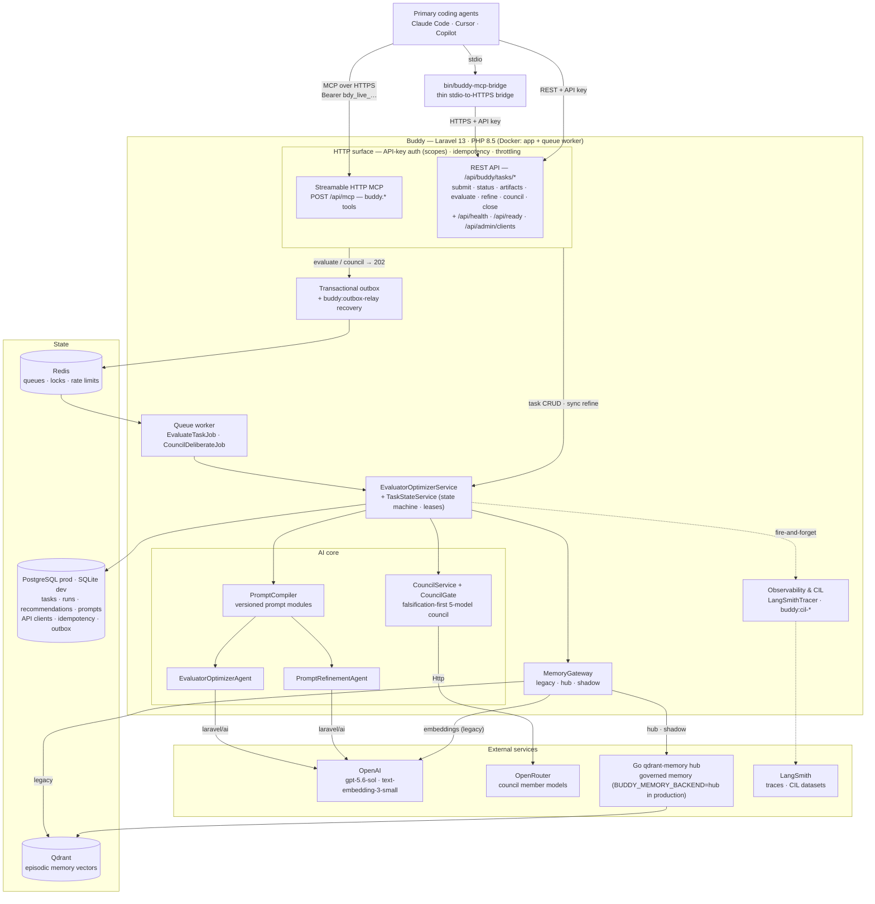

# Buddy

[](https://github.com/ikarolaborda/buddy/actions/workflows/tests.yml)
[](https://opensource.org/licenses/MIT)

An evaluator-optimizer sidecar agent for engineering workflows. Buddy helps primary coding agents when their work becomes slow, ambiguous, or repeatedly unsuccessful.

## What is Buddy?

Buddy is not a generic chatbot. It is a specialized engineering evaluator that receives structured problem packets from primary coding agents, searches its episodic memory for similar past problems, generates and evaluates solution hypotheses, and returns either a concrete recommendation or a rejection with actionable feedback.

```
Primary Agent                          Buddy
     |                                   |
     |  1. Submit problem packet  -----> |
     |                                   |  2. Search episodic memory (Qdrant)
     |                                   |  3. Build solution hypotheses
     |                                   |  4. Evaluate against constraints
     |                                   |  5. Score confidence + risks
     |  <---- 6. Return recommendation   |
     |                                   |
     |  7. Close task + store learnings  |
```

## Architecture



The asynchronous evaluation lifecycle, end to end:

1. An agent submits a problem packet (REST `POST /api/buddy/tasks` or the `buddy.submit_problem` MCP tool). The task and its artifacts are persisted in one transaction, deduplicated by `Idempotency-Key`.
2. `evaluate` (or `council`, when the criticality gate allows it) appends an outbox message inside the same transaction and returns `202`. After commit the message is published to the Redis queue; `buddy:outbox-relay` republishes anything a crashed process left behind.
3. A worker claims the task under a lease, searches episodic memory through the `MemoryGateway`, compiles the versioned prompt bundle, and calls the agent via `laravel/ai` with structured output.
4. The run (model, prompt hash, token usage), recommendation, and decision log are persisted transactionally; a trace is sent to LangSmith fire-and-forget. The caller polls task status for the result.
5. `close_task` records the outcome as feedback and optionally distills learnings back into vector memory.

`refine_prompt` is the one synchronous path — it runs the `PromptRefinementAgent` inline and returns the execution-ready brief directly. A full local stdio MCP server (`php artisan buddy:mcp-server`) also exists for development; the thin bridge is the supported stdio fallback for deployed instances (ADR 0003).

## Tech Stack

| Component       | Technology                                                   |
|-----------------|--------------------------------------------------------------|
| Framework       | Laravel 13.x                                                 |
| PHP             | 8.5+                                                         |
| AI SDK          | [laravel/ai](https://laravel.com/ai) v0.3.2                 |
| Evaluator Model | gpt-5.6-sol (configurable)                                   |
| Vector DB       | Qdrant (episodic memory + semantic search)                   |
| Database        | SQLite (dev) / PostgreSQL (production)                       |
| Queue           | Laravel database queue (dev) / Redis (production)            |
| MCP Transport   | Streamable HTTP (production) / stdio via `buddy-mcp-bridge` or `buddy:mcp-server` (local dev) |
| Testing         | PHPUnit 12.x with Laravel AI SDK fakes                       |
| Formatting      | Laravel Pint                                                 |

## Quick Start

### Prerequisites

- PHP 8.5+
- Composer
- An Azure OpenAI resource and API key (or another Laravel AI provider)
- Qdrant running locally (or via Docker)

### Local Setup

```bash
# Clone and install
git clone <repo-url> buddy
cd buddy
composer install

# Configure environment
cp .env.example .env
php artisan key:generate

# Set the Azure OpenAI values in .env
# AZURE_OPENAI_API_KEY=...
# AZURE_OPENAI_URL=https://your-resource.openai.azure.com

# Create database and run migrations
touch database/database.sqlite
php artisan migrate

# Start development server
composer dev
```

### Docker Setup (recommended)

No PHP 8.5 required on the host. The Docker entrypoint automatically bootstraps a fresh clone:

```bash
# Clone and start — that's it
git clone https://github.com/ikarolaborda/buddy.git
cd buddy
docker compose build
docker compose up -d
```

The entrypoint detects a fresh clone and automatically:
1. Copies `.env.example` to `.env` (if `.env` is missing)
2. Installs Composer dependencies inside the container (if `vendor/` is missing)
3. Generates `APP_KEY` (if not set)
4. Creates the SQLite database and runs migrations (if database is missing)

If everything is already present, the entrypoint skips all bootstrap steps.

After startup, set your Azure OpenAI connection in `.env`:
```bash
# Edit .env and set AZURE_OPENAI_API_KEY and AZURE_OPENAI_URL
```

This starts two services:
- **app** — Laravel HTTP server on port 8000
- **queue** — Background queue worker for async evaluations

Both connect to your existing Qdrant container (`qdrant-memory-db`) via the `qdrant-memory_default` Docker network.

## Configuration

All Buddy-specific configuration lives in `config/buddy.php` and `.env`:

| Variable                    | Default                   | Description                          |
|-----------------------------|---------------------------|--------------------------------------|
| `BUDDY_MODEL`              | `gpt-5.6-sol`            | AI model for evaluation              |
| `BUDDY_EVALUATOR_PROVIDER` | `azure`                 | Laravel AI provider for evaluation   |
| `BUDDY_REFINER_PROVIDER`   | `azure`                 | Laravel AI provider for refinement   |
| `BUDDY_MODEL_ROUTING`      | `false`                 | Optional problem-type model routing  |
| `BUDDY_EMBEDDING_MODEL`    | `text-embedding-3-small`  | Model for vector embeddings          |
| `BUDDY_MAX_EVALUATION_STEPS` | `10`                   | Max tool-use steps per evaluation    |
| `BUDDY_EVALUATION_TIMEOUT` | `120`                     | Timeout in seconds                   |
| `QDRANT_HOST`              | `http://localhost`        | Qdrant server host                   |
| `QDRANT_PORT`              | `6333`                    | Qdrant server port                   |
| `QDRANT_API_KEY`           | (empty)                   | Qdrant API key (optional)            |
| `QDRANT_COLLECTION`        | `buddy_episodes`          | Qdrant collection for episodes       |
| `QDRANT_KNOWLEDGE_COLLECTION` | `buddy_knowledge`      | Qdrant collection for distilled knowledge |
| `QDRANT_VECTOR_SIZE`       | `1536`                    | Embedding vector dimensions          |

AI provider keys are configured via Laravel AI SDK in `config/ai.php`:

| Variable                     | Description                                  |
|------------------------------|----------------------------------------------|
| `AZURE_OPENAI_API_KEY`       | Azure OpenAI API key                         |
| `AZURE_OPENAI_URL`           | Azure OpenAI resource URL                    |
| `AZURE_OPENAI_DEPLOYMENT`    | Azure deployment name                        |
| `OPENAI_API_KEY`             | Optional direct-OpenAI fallback for local use |

## REST API

All endpoints are prefixed with `/api/buddy`.

### Create Task

```
POST /api/buddy/tasks
```

Create a new evaluation task from a structured problem packet.

**Request:**
```json
{
  "source_agent": "claude",
  "task_summary": "Login page returns 500 after OAuth callback",
  "problem_type": "bug",
  "repo": "acme/webapp",
  "branch": "feature/oauth-fix",
  "constraints": ["preserve backward compatibility"],
  "evidence": [
    {"type": "error_log", "content": "NullPointerException at AuthController:42"}
  ],
  "artifacts": [
    {"type": "stacktrace", "content": "..."}
  ],
  "requested_outcome": "Fix the 500 error on OAuth callback"
}
```

**Response (201):**
```json
{
  "data": {
    "task_id": "01JDZK...",
    "source_agent": "claude",
    "task_summary": "Login page returns 500 after OAuth callback",
    "problem_type": "bug",
    "status": "pending",
    "attempt_count": 0,
    "created_at": "2026-03-21T20:00:00.000Z"
  }
}
```

### Get Task

```
GET /api/buddy/tasks/{ulid}
```

Returns the task with its latest recommendation (if evaluated).

### Attach Artifact

```
POST /api/buddy/tasks/{ulid}/artifacts
```

Attach evidence to an existing task before evaluation.

**Request:**
```json
{
  "type": "log",
  "content": "ERROR 2026-03-21 Auth failed at line 42",
  "metadata": {"file": "auth.log"}
}
```

Artifact types: `log`, `test_output`, `stacktrace`, `code_snippet`, `diff`, `config`, `screenshot`, `other`.

### Evaluate Task

```
POST /api/buddy/tasks/{ulid}/evaluate
POST /api/buddy/tasks/{ulid}/evaluate?sync=1
```

Run the evaluator-optimizer agent on the task. By default the evaluation is dispatched to a queue worker and returns immediately with status `202`; poll `GET /api/buddy/tasks/{ulid}` for the recommendation. With `?sync=1` (or when no real queue driver is configured, e.g. local development) it runs inline and returns the recommendation directly. Inline runs hold a server worker for up to the provider timeout, so keep them out of production traffic.

**Synchronous Response (200):**
```json
{
  "task": { "task_id": "01JDZK...", "status": "completed", "..." : "..." },
  "evaluation": {
    "accepted": true,
    "confidence": "high",
    "summary": "The OAuth callback needs a null check on the user object.",
    "recommended_plan": [
      "Add null check at AuthController:42",
      "Add test coverage for null user case"
    ],
    "rejected_reasons": [],
    "required_followups": [],
    "risks": ["Minimal - isolated change"],
    "next_actions": ["Apply the fix", "Run test suite"],
    "memory_hits": ["Similar OAuth issue resolved 2 weeks ago"]
  }
}
```

### Close Task

```
POST /api/buddy/tasks/{ulid}/close
```

Close a completed task and optionally store durable learnings in Qdrant.

**Request:**
```json
{
  "learnings_summary": "OAuth callback must validate user object before redirect."
}
```

## Using the Deployed Buddy with Zero Local Files (Remote MCP)

The deployed Buddy serves native Streamable HTTP MCP at `/api/mcp` — no clone,
no bridge script, nothing local except one config block:

```json
{
  "mcpServers": {
    "buddy": {
      "type": "http",
      "url": "https://<your-buddy-host>/api/mcp",
      "headers": {
        "Authorization": "Bearer bdy_live_..."
      }
    }
  }
}
```

Or from the CLI:

```bash
claude mcp add --transport http buddy https://<your-buddy-host>/api/mcp \
  --header "Authorization: Bearer bdy_live_..."
```

Same seven tools, same per-client isolation, same scopes as the REST API. The
server is stateless (no SSE stream; GET returns 405 as the spec permits).
Static bearer auth is intended for your own agents; spec-complete OAuth 2.1
remains the gate before any public third-party exposure (ADR 0003).

Onboarding a fresh machine? Hand the agent an API key and point it at
[docs/recipes/remote-machine-onboarding.md](docs/recipes/remote-machine-onboarding.md) —
it verifies the endpoint, installs the config, sweeps stale local entries,
and syncs any local agent memories to the cloud on its own.

## Using the Deployed Buddy from Other Projects (MCP Bridge)

Any project can talk to a deployed Buddy through the thin stdio bridge
`bin/buddy-mcp-bridge`. The bridge holds no application secrets — only the API
base URL and a per-project API key — and forwards MCP tool calls to Buddy's
authenticated REST API.

### 1. Issue an API key for the project

Each connecting project/agent gets its own client and key, so usage is
auditable and keys are individually revocable. With an admin-scoped key
(minted once via `php artisan buddy:client:create <name> --scopes=admin`):

```bash
BUDDY_BASE_URL=https://<your-buddy-host> \
BUDDY_ADMIN_KEY=bdy_live_... \
  bin/buddy-issue-key my-new-agent
```

This calls `POST /api/admin/clients` and prints the new `bdy_live_...` key
once. Default scopes are `tasks:read,tasks:write`; the endpoint refuses to
mint admin-scoped keys (CLI only, so a leaked admin key cannot breed more).

### 2. Point the project's Claude Code config at the bridge

In `~/.claude.json` under the project's `mcpServers` (or in project-level
`.claude/settings.json`):

```json
{
  "mcpServers": {
    "buddy": {
      "type": "stdio",
      "command": "/path/to/buddy/bin/buddy-mcp-bridge",
      "env": {
        "BUDDY_BASE_URL": "https://<your-buddy-host>",
        "BUDDY_API_KEY": "bdy_live_..."
      }
    }
  }
}
```

Restart the session; the bridge exposes `buddy.submit_problem`,
`buddy.evaluate_task` (async — poll with `buddy.get_task_status`),
`buddy.refine_prompt`, `buddy.attach_artifact`, and `buddy.close_task`.

Task access is isolated per client: a key can only see and mutate tasks its
own client created (admin-scoped keys bypass; a non-owner receives 404).

## MCP Server (local, full stack)

Buddy also exposes itself as a local MCP server so external coding agents can use it as a tool. The MCP server runs inside Docker — no PHP 8.5 installation required on the host.

### Connecting from Claude Code

Add to your Claude Code settings (`~/.claude/settings.json` or project-level `.claude/settings.json`):

```json
{
  "mcpServers": {
    "buddy": {
      "command": "docker",
      "args": [
        "run", "--rm", "-i",
        "--network", "qdrant-memory_default",
        "-e", "QDRANT_HOST=http://qdrant-memory-db",
        "-v", "/home/iclaborda/Aerolambda/buddy/.env:/var/www/html/.env",
        "-v", "/home/iclaborda/Aerolambda/buddy/database:/var/www/html/database",
        "buddy-app",
        "php", "artisan", "buddy:mcp-server"
      ]
    }
  }
}
```

Secrets (`AZURE_OPENAI_API_KEY`, `APP_KEY`) are read from the mounted `.env` file — they never appear in the Claude config. Only the Docker network override (`QDRANT_HOST`) is passed as `-e` because the hostname differs inside the container network.

**Prerequisites:** Build the image once with `docker compose build` from the Buddy directory. Set your API keys in the Buddy `.env` file.

### Starting the MCP Server Directly

```bash
# Via Docker (recommended — no PHP 8.5 required)
docker run --rm -i \
  --network qdrant-memory_default \
  -e QDRANT_HOST=http://qdrant-memory-db \
  -v /path/to/buddy/.env:/var/www/html/.env \
  -v /path/to/buddy/database:/var/www/html/database \
  buddy-app \
  php artisan buddy:mcp-server

# Or natively (requires PHP 8.5)
php artisan buddy:mcp-server
```

### Available MCP Tools

| Tool                      | Description                                          |
|---------------------------|------------------------------------------------------|
| `buddy.submit_problem`    | Submit a structured problem packet for evaluation    |
| `buddy.get_task_status`   | Get the current status of a task                     |
| `buddy.get_recommendation`| Trigger evaluation and get the recommendation        |
| `buddy.search_memory`     | Search episodic memory for past problems/patterns    |
| `buddy.store_memory`      | Store distilled engineering knowledge                |
| `buddy.attach_artifact`   | Attach evidence to an existing task                  |
| `buddy.close_task`        | Close a task and optionally store learnings          |

## Escalation Trigger Policy

Buddy is designed to be called when a primary agent's work degrades. The recommended trigger policy escalates to Buddy when **at least two** of these conditions are true:

| Condition                  | Threshold         |
|----------------------------|-------------------|
| Time elapsed               | > 5 minutes       |
| Failed attempts            | > 2               |
| Repeated test failure      | persists          |
| Confidence                 | low               |
| Root cause                 | ambiguous         |
| Evidence                   | conflicts         |

The `EscalationTrigger` DTO and `EscalationService` implement this policy. See the agent-facing protocol document (`AGENT.md`) for integration details.

## Memory System

Buddy uses Qdrant for long-term episodic memory:

- **Storage**: Every closed task can store distilled learnings as vectors
- **Retrieval**: On every evaluation, Buddy searches memory for similar past episodes
- **Metadata Filtering**: Memories are tagged by `task_intent`, `stack`, `subsystem`, `symptom`, `root_cause`, `solution_pattern`, and `outcome`
- **Embeddings**: Generated via OpenAI's `text-embedding-3-small` model through `laravel/ai`

Only distilled, reusable knowledge is stored. Raw transcripts are not persisted unless distilled first.

### Initializing Qdrant Collections

```bash
# Ensure Qdrant is running, then use tinker to create collections:
php artisan tinker
>>> app(\App\Services\QdrantMemoryService::class)->ensureCollectionExists()
```

## Testing

```bash
# Run all tests
php artisan test

# Run specific test suites
php artisan test --filter=BuddyTaskApiTest
php artisan test --filter=EscalationTriggerTest
```

Tests use `laravel/ai`'s built-in `Agent::fake()` to mock AI interactions. The test suite runs entirely against SQLite with no external service dependencies.

## Project Structure

```
app/
├── Ai/
│   ├── Agents/
│   │   └── EvaluatorOptimizerAgent.php    # Core AI agent
│   └── Tools/
│       └── SearchMemoryTool.php            # Agent tool for memory search
├── Console/Commands/
│   └── McpServerCommand.php                # MCP stdio server
├── DTOs/
│   ├── ProblemPacket.php                   # Input contract
│   ├── EvaluationResult.php                # Output contract
│   ├── EscalationTrigger.php               # Escalation policy
│   └── MemorySearchResult.php              # Qdrant result wrapper
├── Enums/
│   ├── TaskStatus.php                      # pending/evaluating/completed/failed/closed
│   ├── ProblemType.php                     # bug/test_failure/performance/...
│   ├── RunStatus.php                       # started/completed/failed
│   ├── Confidence.php                      # high/medium/low/none
│   └── ArtifactType.php                    # log/test_output/stacktrace/...
├── Http/
│   ├── Controllers/Api/Buddy/
│   │   └── BuddyTaskController.php         # REST API (5 actions)
│   ├── Requests/Buddy/                     # Form request validation
│   └── Resources/Buddy/                    # API response formatting
├── Jobs/
│   └── EvaluateTaskJob.php                 # Async evaluation queue job
├── Mcp/
│   ├── McpTool.php                         # Tool interface
│   ├── BaseMcpTool.php                     # Base class
│   ├── McpToolRegistry.php                 # Tool registration
│   └── Tools/                              # 7 MCP tool implementations
├── Models/
│   ├── BuddyTask.php                       # Primary entity
│   ├── BuddyRun.php                        # Evaluation run
│   ├── BuddyArtifact.php                   # Evidence attachment
│   ├── BuddyRecommendation.php             # AI recommendation
│   ├── BuddyQuestion.php                   # Clarifying question
│   ├── BuddyMemoryReference.php            # Qdrant memory link
│   └── BuddyDecisionLog.php                # Audit trail
└── Services/
    ├── EvaluatorOptimizerService.php        # Orchestration
    ├── QdrantMemoryService.php              # Qdrant HTTP client
    └── EscalationService.php                # Trigger evaluation
```

## Design Decisions

- **Single escalation hop**: Buddy never spawns other Buddy instances. This prevents unbounded agent loops.
- **Qdrant via HTTP facade**: No extra PHP client package. The Qdrant REST API is simple enough that `Http::baseUrl()` is sufficient.
- **Laravel 13 PHP attributes**: Controller middleware (`#[Middleware]`) and queue job configuration (`#[Tries]`, `#[Timeout]`, `#[FailOnTimeout]`) are declared via attributes.
- **laravel/ai structured output**: The `HasStructuredOutput` interface with `JsonSchema` builder guarantees the AI returns data matching the `EvaluationResult` shape.
- **Auditable AI**: Every evaluation creates a `BuddyRun` (with model and token usage), a `BuddyRecommendation`, and a `BuddyDecisionLog`.

## License

MIT
