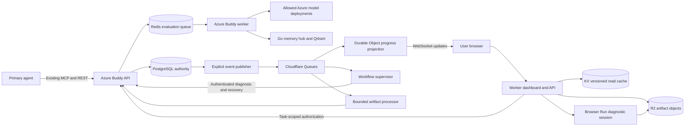
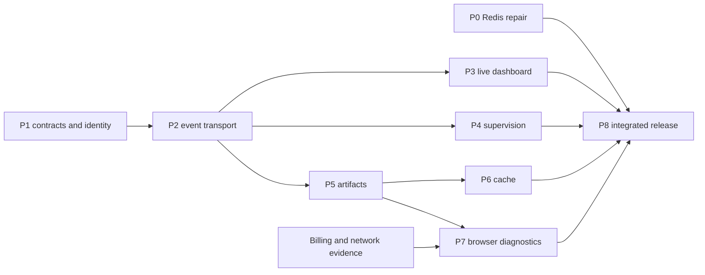

# Cloudflare implementation plan for Buddy

Date: 2026-09-15. Status: proposed implementation, ready for engineering work.

This plan covers all six agreed Cloudflare capabilities and the existing Redis autoscaling fault.
It records the implementation order, contracts, tests, operating limits, and release gates.
Writing this plan does not activate resources, change models, or deploy application code.

Read the [Claude handoff](../handoffs/2026-09-15-cloudflare-buddy.md) before starting work.
The handoff contains the current deployment identity and commands for the first investigation.

## 1. Outcomes and scope

| Work package | Capability | User outcome | Completion evidence |
| --- | --- | --- | --- |
| P0 | Azure Redis autoscaling repair | Pending evaluations gain worker capacity | Controlled backlog causes scale-out, then drains without duplicate task results |
| P1 | Shared contracts, identity, and deployment foundation | Every new feature respects task ownership | Contract tests, client isolation tests, separate preview resources |
| P2 | Cloudflare Queues | Background exports and processing survive delivery failures | Duplicate, delayed, reordered, and poison messages pass recovery tests |
| P3 | Workers and Durable Objects | A dashboard shows live task and council progress | Reconnect, replay, stale-state indication, and polling fallback work |
| P4 | Workflows | Buddy diagnoses service failures and recovers eligible evaluations | One recovery child per eligible failed task, with an audit record |
| P5 | R2 | Agents attach and retrieve large diagnostic evidence | Upload, processing, download, retention, and deletion pass authorization tests |
| P6 | Workers KV | Repeated safe reads reduce origin work | Measured origin reduction with no authorization or freshness regression |
| P7 | Browser Run | Authorized URL diagnostics produce bounded evidence | Billing eligibility and network controls pass before a live pilot |
| P8 | Integrated release and operations | The complete system remains understandable and reversible | Fault exercises, cost controls, runbooks, and source parity pass |

All six capabilities remain in scope. Browser Run implementation can use mocks while its billing gate remains unresolved.
The first production repair is P0. The first new user feature is the read-only progress dashboard after P1 and P2.

The following user decisions apply throughout:

- Run every real model evaluation through the deployed Azure Buddy instance.
- Keep Azure as the default council and remain within authorized credit coverage.
- Keep Astra at `xhigh` as chairman and use only deployments allowed by Azure policy.
- Keep the optional Sol route disabled while it requires separate OpenRouter payment.
- Preserve each Mac's credentials, local database, and archived database files.
- Limit interventions to service diagnosis and recovery of eligible failed Buddy evaluations.
- Keep refusal, credential, approval, and harness restrictions outside automatic recovery.

Local tests can use HTTP and AI fakes. Local Buddy containers are not production evaluation targets.
Browser diagnostics extend the current evidence boundary only through an explicit, separately tested operation.
They do not add repository cloning, repository credentials, arbitrary commands, or browser session injection.

## 2. Verified starting point

These facts come from repository and account observations on 2026-09-15.
Treat them as a dated baseline and read the live state again before changing infrastructure.

| Item | Observed value |
| --- | --- |
| Source and remote `main` | `aa2c1920c57f92a8e93576b46795eaa85cacc03f` |
| Local and M5P checkout | `/Users/ikarolaborda/Aerolambda/buddy` |
| M5P host | `ikaros-macbook-pro-m5p.local` |
| Production MCP | `https://buddy.aerolambda.tech/api/mcp` |
| Azure subscription | `e7e7a0f4-2689-47ed-b7e0-ce68d8394cc4` |
| Resource group | `rg-buddy-credit` |
| API revision | `ca-buddy-api-credit--sol-aa2c192` |
| Worker revision | `ca-buddy-worker-credit--sol-aa2c192` |
| API image | `acrbuddycreditoerh7kdnhtzo6.azurecr.io/buddy:aa2c192-octane` |
| Worker image | `acrbuddycreditoerh7kdnhtzo6.azurecr.io/buddy:aa2c192` |
| Scaling | API 1–5 replicas, worker 1–4 replicas |
| Council | Azure, Astra `xhigh` chairman, three GPT-5.5 `high` reviewers |
| Sol flag | `BUDDY_COUNCIL_WORKERS_AI_SOL=false` on both services |
| Cloudflare account | `63cc5315181fb5f7fbf59dac3efcf76e` |
| Startup grant | $10,000 original grant, expires `2027-08-11T13:01:00.902Z` |
| Last observed grant balance | $9,999.65, a dated observation, not a live balance guarantee |
| DNS | GoDaddy nameservers, Buddy CNAME points directly to Azure Container Apps |

The API and worker were running. Repeated public health requests returned `{"status":"ok"}`.
The migration job succeeded with no pending migrations.
CI run `34979750226` passed 290 SQLite tests and 55 PostgreSQL tests.
Three PostgreSQL-only tests were skipped in the SQLite job.

The worker's autoscaler reported this error at 14:26:52 UTC:

```text
KEDAScalerFailed
connection to redis failed: dial tcp 100.100.226.25:6379: connect: connection refused
```

The error does not prove that the worker cannot consume Redis jobs.
The scaler and the worker can use different network paths.
The IaC currently specifies `listName: 'buddy:queue:default'`.
The real Redis database, Laravel prefix, and list key still need measurement.

The current Azure policy, `startup-credit-ai-only`, allows Astra, GPT-5.5, and `text-embedding-3-small` model versions.
It excludes the requested Sol and Terra deployments.
The three reviewers share one model family. Their separate roles do not establish model diversity.
GLM-5.3 is absent from shipped rosters after timeout failures.

Cloudflare already hosts `qdrant-memory-cloud-sync`, memory queues, three memory workflows, and two memory Durable Object classes.
The account also contains `buddy-memory-sync` and other R2 buckets.
Reuse their design patterns, but create separate Buddy resources.
Do not change the memory service's queues, task authority, or disabled Autopilot schedule.

## 3. Architecture and data ownership

A projection is a replaceable copy used for reads.
An outbox records events in the same transaction as business changes.
An inbox records consumed events to prevent duplicate effects.
Idempotency means that repeating a request preserves one logical result.

PostgreSQL remains the authority for tasks, ownership, leases, recovery, and artifact metadata.
Redis remains the Laravel work queue after P0.
Qdrant remains the authority for memory retrieval through the governed Go hub.
Cloudflare provides progress delivery, supervision, artifact storage, background transport, and bounded read caching.



The diagram shows the target architecture. None of these new Cloudflare paths is deployed by this planning change.
A Cloudflare outage must not stop task submission or ordinary Azure evaluation.
The existing MCP endpoint retains its transport behavior and address.

| Data | Authority | Cloudflare representation | Rule |
| --- | --- | --- | --- |
| Task state and client ownership | PostgreSQL | Minimal progress projection | Never authorize or claim work from a projection |
| Evaluation claims and leases | PostgreSQL | Read-only status fields | Cloudflare cannot overwrite a live claim |
| Queue execution | Laravel and Redis | Supervisor observations | Queues does not replace the evaluation queue in this plan |
| Artifact identity and access | PostgreSQL | Opaque R2 object reference | An object key never grants ownership |
| Artifact bytes | R2 after finalization | Private immutable objects | Original hash and derived-output lineage remain recorded |
| Episodic memory | Qdrant through the Go hub | Existing memory infrastructure | No second memory authority in KV, D1, or Vectorize |
| API clients and revocation | PostgreSQL | Short-lived delegated sessions | KV cannot decide authorization or revocation |

## 4. P0: repair Redis autoscaling

KEDA is the metrics-based autoscaler used by Azure Container Apps.
Its Redis metric must reach the queue and measure the correct pending list.
[Azure documents the scaling rules and revision behavior](https://learn.microsoft.com/en-us/azure/container-apps/scale-app).

Implement these steps in order:

1. Record the current images, traffic, replica limits, Redis application, and scaler rules.
2. Read the deployed worker's effective Redis connection without printing passwords.
3. Measure the Redis database number, prefix, pending list, delayed set, and reserved set.
4. Compare those values with `config/database.php`, `config/queue.php`, and the worker Bicep module.
5. Test the worker data path separately from the scaler network path.
6. Distinguish name resolution, routing, TCP refusal, TLS mismatch, authentication failure, and wrong-key measurements.
7. Inspect Container Apps environment networking and Redis TCP ingress before selecting a fix.
8. Apply the smallest network or endpoint repair that preserves private access.
9. Put the measured queue key, database, TLS mode, and authentication reference in IaC.
10. Deploy a new worker revision with the same application image for the infrastructure-only repair.
11. Submit synthetic jobs that perform no model calls.
12. Record backlog, desired replicas, ready replicas, drain rate, task effects, and scaler logs.

A historical short-name Redis connection fixed a worker path. It does not prove that KEDA can use that path.
Do not replace the host with a short name solely because it worked in July.
Do not expose Redis publicly as a routine fix.

If internal Redis remains unreachable from the scaler, evaluate a supported private managed Redis topology.
Recheck current quota, region support, and startup coverage before selecting that alternative.
Record the evidence and migration procedure in an ADR, an architecture decision record.
Do not use CPU scaling as proof of queue scaling. Waiting for model responses can consume little CPU.

Keep at least one API and one worker replica during the current startup milestone window, approximately through 2026-10-10.
Retain the current timeout order: council 1,800 seconds, worker 1,860 seconds, Redis retry and council lease 2,400 seconds.
Do not drain, delete, or reset production queues to run the experiment.
Redis persistence and single-replica failure remain separate risks to record after diagnosis.

Acceptance: a synthetic backlog large enough for the configured threshold causes at least two ready workers.
The proposed observation target is 120 seconds after metric visibility.
Observe scale-in through its configured cooldown and confirm that at least one worker remains.
Require no duplicate logical results and no new scaler connection errors during the observation window.

## 5. P1: contracts, identity, and resource foundation

Create a separate `cloudflare/buddy-edge/` TypeScript Worker package with a pinned toolchain and lockfile.
Keep resource definitions under `infra/cloudflare/` and deployment instructions under `docs/recipes/`.
Select one declarative provisioning method in the first ADR. Record resource IDs without secrets.
Create separate preview and production bindings, credentials, queues, buckets, and Durable Object namespaces.

Proposed resources:

| Resource | Proposed name | Purpose |
| --- | --- | --- |
| Worker | `buddy-edge-preview`, `buddy-edge-prod` | Dashboard, scoped edge endpoints, event consumer |
| Durable Object class | `BuddyTaskProgress` | One progress stream per client and task |
| Queue and dead-letter queue | `buddy-events-{env}`, `buddy-events-dlq-{env}` | Progress and supervision delivery |
| Queue and dead-letter queue | `buddy-artifacts-{env}`, `buddy-artifacts-dlq-{env}` | Artifact work, isolated from progress |
| Workflow | `buddy-task-supervisor-{env}` | Bounded health and recovery supervision |
| R2 bucket | `buddy-artifacts-{env}` | New private artifact objects |
| KV namespace | `BUDDY_READ_CACHE_{ENV}` | Versioned, authorized read payloads |

Names are proposals. Check availability before creating resources.
Use `workers.dev` for the pilot because the domain currently uses GoDaddy nameservers.
A later custom hostname needs an explicit DNS design and available zone permissions.
Do not move `buddy.aerolambda.tech` or proxy its MCP traffic as part of the pilot.

### Identity and browser access

Existing API keys remain server-side or in the calling agent.
Do not put the Buddy admin key in browser JavaScript, local storage, URLs, or Cloudflare assets.
The first UI is a single-task view. A task list and organization login require a later explicit product scope.

Add an authenticated Azure endpoint that creates a short-lived, single-task view ticket.
Store only the ticket hash, client identity, task identity, scope, expiry, and consumed time in PostgreSQL.
Exchange the ticket once for an HttpOnly, Secure session with a narrow path and SameSite policy.
If the ticket travels in a link, use a URL fragment and clear it immediately after exchange.
Use a strict origin policy, Content Security Policy, and `Referrer-Policy: no-referrer`.

The Worker authenticates to Azure with its own limited service identity.
Each request also carries the original delegated client and task scope.
Azure checks the owner and current authorization on every protected request.
A service credential alone never authorizes access to every client's tasks.
Revocation fails closed. An Azure authorization outage cannot turn a cached payload into public data.

Create WebSocket tickets only after authorization and require an allowed browser origin.
Use short expiry and a defined session renewal interval for open connections.
Store only minimal progress fields in the connection and Durable Object.
Add intervention controls later, with the original client's `interventions:execute` scope and CSRF protection.

Use separate credentials for deployment, event publishing, artifact access, and delegated Azure callbacks.
The existing Azure token has Workers AI permissions only.
Do not broaden it or copy the local admin token into Azure or a Worker.
Keep Azure-side secrets in Key Vault and Worker-side secrets in Cloudflare's secret mechanism.
Use workload identity where the selected API supports it and document rotation for remaining tokens.

### Event contract

Add a schema version and a stable event ID. Allocate a monotonic sequence per task inside PostgreSQL.
Keep that sequence separate from the existing task `state_version` used for ownership protection.
The proposed event envelope is:

```json
{
  "schema_version": 1,
  "event_id": "EVENT_ULID",
  "type": "buddy.task.progress.v1",
  "client_id": "OPAQUE_CLIENT_ID",
  "task_id": "TASK_ULID",
  "task_sequence": 12,
  "state_version": 4,
  "occurred_at": "2026-09-15T15:00:00Z",
  "trace_id": "OPAQUE_TRACE_ID",
  "data": {"status": "evaluating", "phase": "council.positions", "run_id": "RUN_ULID"}
}
```

Limit an event to 16 KiB as a project policy. Use R2 references for large content.
Exclude prompts, artifacts, credentials, private reasoning, signed URLs, and raw provider errors.
Use distinct event types for progress, terminal state, artifact availability, artifact processing, and export completion.
Define backward compatibility, unknown-version handling, retention, and deletion behavior before publishing version 1.

Acceptance: cross-client access fails for REST, session exchange, WebSocket, download, event ingestion, and callbacks.
Old clients retain their existing MCP and REST behavior.
Preview credentials cannot read or modify production resources.

### Proposed API surface

These routes are design targets, not existing endpoints.
Use existing task authorization and request validation as their foundation.
Keep the current MCP tools compatible and add artifact references to their schemas only through an additive change.

| Owner | Proposed route | Authorization and result |
| --- | --- | --- |
| Azure | `POST /api/buddy/tasks/{task}/view-tickets` | `tasks:read`, task ownership, single-use ticket with a 60-second expiry |
| Worker | `POST /session/exchange` | One-time ticket exchange through Azure, then a scoped browser session |
| Worker | `GET /tasks/{task}` | Browser session and fresh Azure authorization, dashboard snapshot |
| Worker | `POST /tasks/{task}/stream-tickets` | Task session, allowed origin, short-lived WebSocket ticket |
| Worker | `GET /tasks/{task}/events` | Authenticated WebSocket upgrade, bounded replay after a supplied sequence |
| Azure | `POST /api/buddy/tasks/{task}/artifact-uploads` | `tasks:write`, ownership, quota, upload reservation |
| Azure | `POST /api/buddy/tasks/{task}/artifact-uploads/{upload}/complete` | Reservation owner, actual object checks, idempotent finalization |
| Azure | `GET /api/buddy/tasks/{task}/artifacts/{artifact}/download` | `tasks:read`, ownership, ready status, short-lived download or authorized stream |
| Azure | `DELETE /api/buddy/tasks/{task}/artifacts/{artifact}` | `tasks:write`, ownership, immediate access tombstone |
| Azure | Existing `POST /api/buddy/tasks/{task}/interventions` | Original delegated owner and `interventions:execute`, existing recovery limits |
| Azure | `POST /api/buddy/tasks/{task}/diagnostic-captures` | New `diagnostics:capture` scope, explicit target policy, billing and budget gates |

Reserve `/api/internal/cloudflare/` for narrow service callbacks with delegated ownership and replay protection.
Do not accept arbitrary task status writes at that prefix.
Event publication uses the selected authenticated Cloudflare API, not a public unauthenticated ingestion route.

Return stable error codes for expired sessions, owner mismatch, quota exhaustion, pending processing, and unavailable dependencies.
Use `202` for accepted asynchronous work and provide an authorized status reference.
Use `409` when an idempotency key repeats with a different payload.
Document pagination, maximum page size, and request limits for any collection endpoint added during implementation.

## 6. P2: reliable background transport with Queues

Cloudflare Queues delivers at least once and does not guarantee order.
Consumers must tolerate duplicates and reordered messages.
[Delivery guarantees](https://developers.cloudflare.com/queues/reference/delivery-guarantees/).

First repair `OutboxPublisher::dispatchFor()`.
Its current fallback can map an unknown event topic to evaluation dispatch.
Create an explicit topic registry with distinct handlers and a safe rejection path for unknown topics.
Do not apply task-terminal filtering to events that report completion.
Keep existing evaluation and knowledge-prefetch behavior covered by regression tests.

Separate local job dispatch from Cloudflare publication.
Record delivery state per destination so one successful destination cannot hide another failed destination.
Publish after commit for low delay and retain a periodic relay as the recovery path.
Bound publication time so a Cloudflare failure cannot hold a task submission open indefinitely.
The outbox remains pending until durable external acceptance.

Do not attach competing consumers to one queue and assume that each receives every event.
Use one dispatcher with durable per-handler delivery state, or explicit publication to separate destination queues.
Progress delivery and supervisor creation must each have a recorded outcome before their shared envelope is acknowledged.
If one handler fails after another succeeds, retry only through idempotent handlers.

Consumers acknowledge only after a durable effect or inbox record.
Use unique event IDs and transactional inbox records where PostgreSQL changes follow.
Durable Objects discard old sequences and request an authoritative snapshot when they detect gaps.
Make artifact processing safe to repeat with `(artifact_id, content_hash, processor_version)` as its logical key.

Use bounded exponential backoff, five attempts as a pilot default, and a dead-letter queue for poison messages.
A dead-letter queue retains messages that exhaust retries.
Build a redacted replay command with filters, a dry run, and an audit record.
Replaying messages never creates new inference merely because delivery repeated.

Choose a Worker consumer for short coordination steps.
Use an Azure pull consumer or asynchronous Azure job for processing that exceeds Worker limits.
The selected consumer must remain private or authenticate every callback.
[Cloudflare supports external pull consumers](https://developers.cloudflare.com/queues/configuration/pull-consumers/).

Cloudflare limits queue messages to 128 KB and push-consumer wall time to 15 minutes.
The 30-minute council therefore stays on Azure's existing evaluation queue.
[Queue limits](https://developers.cloudflare.com/queues/platform/limits/).

Acceptance: crash after publish, crash after effect, duplicate delivery, out-of-order delivery, and poison payload tests pass.
A Cloudflare outage leaves recoverable outbox entries while Azure evaluation continues.
The relay catches up without duplicate recoveries or lost terminal events.

## 7. P3: live progress with Workers and Durable Objects

Serve the dashboard through Workers static assets and a small authenticated API.
Use Durable Object WebSocket hibernation for idle connections.
[Static assets](https://developers.cloudflare.com/workers/static-assets/) and [WebSocket hibernation](https://developers.cloudflare.com/durable-objects/best-practices/websockets/).

Add a progress service that emits bounded lifecycle facts after durable state changes.
Proposed phases include `queued`, `memory`, `evaluation`, `council.frame`, `council.positions`, `council.attacks`, and `council.verdict`.
Report final success, failure, and recovery links from authoritative task state.
Show actual model names and review roles when a council starts.
Do not render private model reasoning or invent progress percentages.

Extend task status with additive fields:

- `phase`, `phase_started_at`, and `phase_deadline_at`.
- `queued_at`, `worker_started_at`, and `heartbeat_at`.
- `progress_sequence`, `progress_observed_at`, and `next_poll_after_ms`.
- `recovery_task_id` and a bounded, user-safe failure category.

Expose queue wait separately from model time.
The current heartbeat occurs between council rounds, so silence within a provider call does not prove a stall.
The dashboard can say that an update is delayed without claiming that the task failed.
Do not expose execution-owner secrets or provider response IDs to the browser.

Each Durable Object stores a bounded snapshot and replay buffer.
Use a proposed buffer limit of 100 events or 24 hours, whichever expires first.
On reconnect, the browser supplies its last sequence and receives missing events or a replacement snapshot.
On a gap, the Worker obtains a fresh authorized Azure snapshot.
Refresh active sessions and stop delivery when authorization expires or the task is deleted.

Provide a visible polling fallback when WebSockets fail.
Show the time of the last authoritative observation and the time of the latest received event.
Add accessible status text, keyboard navigation, empty states, and mobile layouts.
Defer task editing and intervention buttons until their separate write authorization passes.

Acceptance: progress survives page reload, network loss, Durable Object restart, and queue delay.
No client receives another client's event, artifact reference, or model output.
The proposed target is p95 event delivery within three seconds on the healthy fast path.
The relay recovery target is 120 seconds. Measure both before claiming performance gains.

## 8. P4: health supervision and bounded recovery with Workflows

Use Workflows for durable waiting, retries, and explicit external events.
Do not run a council inside a Workflow step.
[Workflows](https://developers.cloudflare.com/workflows/) and [external events](https://developers.cloudflare.com/workflows/build/events-and-parameters/).

Create one supervisor identity per task execution generation.
Start it from a durable event and make creation safe to repeat.
Use terminal events to end supervision, with periodic authoritative reads as a fallback.
Cap polling frequency, total lifetime, concurrent instances, and daily callback volume.

The supervisor follows this decision table:

| Authoritative condition | Action |
| --- | --- |
| Task waits in queue | Record queue age and diagnose service health after the configured delay |
| Live claim remains valid | Wait within the recorded phase deadline |
| Heartbeat is old during an active model call | Read phase and provider-operation state, then diagnose without forcing failure |
| Lease expires | Let the existing Azure ownership and reaper rules decide the task state |
| Original evaluation fails with a trusted transient error | Request the existing bounded recovery operation once |
| Permanent failure, refusal, approval restriction, or credential restriction | Record the reason and stop automatic recovery |
| Council fails | Diagnose only, because automatic council reruns are not currently supported |
| Task succeeds, closes, or is deleted | End supervision and retain a minimal audit result |

Call `diagnose_health` and `recover_evaluation` through the existing intervention service.
Use a stable request ID derived from the original task and recovery generation.
Preserve the current unique recovery constraint and rejection of recovery chains.
Require the delegated task owner and `interventions:execute` scope at Azure.
Do not use a broad administrator callback to bypass client ownership.

The current diagnostics report dependencies and configuration, not actual worker-process health.
Add bounded worker heartbeat and queue-age diagnostics without exposing raw infrastructure responses.
Do not add model calls to a health endpoint.
Distinguish unhealthy, stale observation, unavailable telemetry, and confirmed task failure.

The current Azure background response ID lives in the worker process.
A process crash can leave accepted inference ambiguous.
Before adding resume behavior, design a durable provider-operation record with an execution owner, response ID, deadline, and cleanup state.
Keep those records server-side and exclude provider output from telemetry.
Reuse an accepted response only through its original provider and execution owner.
If acceptance is ambiguous, stop automatic replay and record the condition.

Council transcript checkpoints are audit artifacts. They are not a resumable execution protocol.
This phase does not promise council checkpoint recovery or exactly-once provider billing.
Cancellation and deletion of stored provider responses remain explicit cleanup duties.

Acceptance: a qualifying failed evaluation creates exactly one logical recovery child under concurrent Workflow retries.
Live tasks, stale owners, recovery children, council failures, and denied requests never create recovery children.
Recovery dispatch occurs within a proposed two minutes after a confirmed eligible failure under healthy dependencies.
Display dispatch and completion as separate states.

## 9. P5: private artifacts in R2

Keep existing inline text artifacts compatible.
Add storage metadata rather than moving every existing artifact in one migration.
Proposed metadata includes object key, size, media type, SHA-256, storage status, original artifact ID, processor version, and retention time.

Add separate operations for upload reservation, upload finalization, authorized download, and deletion.
The server creates an opaque object key and binds it to the owner, task, expected size, and allowed type.
Return a short-lived upload URL, with five minutes as the pilot default.
[R2 supports S3 presigned URLs](https://developers.cloudflare.com/r2/api/s3/presigned-urls/).

Treat a signed URL as a temporary capability and exclude it from logs and memory.
Keep uploads private and quarantined until finalization.
Check the actual size, file signature, content hash, and reservation before marking an artifact ready.
Do not trust a client-provided hash or object metadata alone.
Prevent replacement after finalization with an immutable final key or equivalent enforced storage protocol.
Make finalization and abandoned-upload cleanup safe to repeat.

Proposed pilot limits are 25 MiB per upload, 100 MiB per task, and 1 GiB per client per day.
Select supported formats explicitly: plain text, JSON, bounded trace archives, PNG, and JPEG first.
Reject encrypted archives, archive bombs, executable content, and unsupported formats.
Keep untrusted HTML and SVG out of same-origin inline previews.
Serve downloads with a fixed content type and safe disposition.

Place processing jobs on the artifact queue after finalization.
Extract bounded text, redact known secret patterns, and retain the original hash and processing outcome.
Use CPU, memory, page-count, expansion-ratio, and wall-time limits for parsers.
Keep parser failures visible without breaking the task or repeatedly processing poison files.

Large storage does not imply large model context.
Preserve the existing council limits of 16,000 characters per artifact and 160,000 characters per packet.
Align task-creation and artifact-attachment input limits before expanding supported evidence types.
Store bounded extracted text as task evidence and retain the original object as a separate attachment.
Memory indexing continues through the governed hub and current knowledge-prefetch boundary.

Use a proposed 30-day artifact retention period and a seven-day quarantine period for the pilot.
Mark deletions in PostgreSQL immediately, then remove objects, derived files, cached payloads, and progress references asynchronously.
An expired signed download URL can outlive revocation briefly, so keep its lifetime short and document that bound.
Use an authenticated streaming endpoint when immediate revocation is required.
Document restore procedures without restoring access to deleted or expired objects.

Acceptance: ownership, size limits, malformed files, overwrite attempts, interrupted upload, repeated finalization, deletion, and orphan cleanup pass.
Existing inline artifacts and council context budgets remain compatible.
R2 failure cannot corrupt the original task or create a partially trusted artifact.

## 10. P6: safe read caching with Workers KV

KV is eventually consistent, so changes can remain stale across locations.
Use it for versioned read payloads with acceptable staleness.
[KV consistency model](https://developers.cloudflare.com/kv/concepts/how-kv-works/).

Begin with immutable artifact summaries, parser results, and public capability metadata.
Authorize protected reads before accessing a cached value.
Use client identity, object identity, content hash, and transformation version in protected cache keys.
Include model and prompt versions if a future cached representation depends on either.

Do not cache task claims, leases, authorization, revocation, live task status, or intervention eligibility in KV.
Do not introduce semantic caching of council verdicts or automatic reuse of another client's evidence.
Use a cache miss as a normal path, with bounded origin work and request coalescing where needed.
Do not store full source artifacts in KV when R2 already holds them.

Use immutable keys plus finite expiry, with one hour as the initial summary-cache maximum.
Invalidate access through authoritative deletion and authorization even when a stale object remains in KV.
Record hit rate, origin requests, payload size, and origin authorization time separately.
Cache latency alone does not measure user latency when authorization still calls Azure.

Acceptance: cached results match authorized origin results across clients, deletions, version changes, and cold locations.
Target at least 50% fewer repeated origin payload reads in the selected pilot workload.
Retain caching only where measurements show a useful reduction.

## 11. P7: authorized diagnostics with Browser Run

Browser Run coverage remains unresolved for this startup grant.
The published startup coverage list does not establish eligibility for Browser Run.
The product's included allowance and paid pricing do not prove startup-credit coverage.
[Startup coverage](https://www.cloudflare.com/startups/) and [Browser Run pricing](https://developers.cloudflare.com/browser-run/pricing/).

Implement contracts, fixtures, storage, and mock tests before the billing gate.
Before live activation, obtain account-specific evidence of coverage or explicit authorization for separate payment.
Do not contact Cloudflare on the user's behalf without authorization to send that message.
Keep `BUDDY_EDGE_BROWSER_DIAGNOSTICS=false` until the gate passes.

Introduce a distinct operation for diagnostic capture of an authorized, caller-supplied URL.
Record the client, approved target, purpose, scope, capture policy, and request ID.
Start with public or explicitly authorized test pages without authenticated browser sessions.
The output contains a screenshot, bounded console errors, response status, timing, and redacted network failures.
Store evidence in R2 with the same ownership, retention, and processing rules as other artifacts.

Use Playwright or Puppeteer sessions with Cloudflare's domain guardrails.
The current beta guardrails support sessions, not Quick Actions.
An omitted domain policy permits unrestricted HTTP, so every session must set an explicit policy.
[Browser Run guardrails](https://developers.cloudflare.com/browser-run/features/guardrails/).

Domain allowlists alone do not establish complete network isolation.
Enforce redirect and subrequest policy, deny private and metadata destinations, and constrain non-HTTP channels.
Review DNS rebinding, IP literals, encoded hostnames, and allowed-domain lookalikes.
If the chosen runtime cannot enforce the required boundary, keep live capture disabled.
Do not accept caller JavaScript, arbitrary browser extensions, downloads, or navigation scripts.

Use a proposed 30-second capture limit, one page, ten captures per client per day, and two concurrent sessions globally.
Close sessions after success, failure, or cancellation.
Filter cookies, authorization headers, form content, and sensitive query parameters from evidence.
Do not mint, inject, import, or transfer browser credentials through this operation.

Add a new ADR that explicitly extends [ADR 0010](../adr/0010-caller-curated-context-boundary.md) for this bounded diagnostic capability.
Untrusted page content remains evidence, never an instruction to Buddy or its caller.
Browser capture cannot turn a refused action into an approved action.

Acceptance: allowed fixtures succeed and forbidden targets fail before navigation.
Redirects, subresources, timeouts, malicious page instructions, sensitive logs, and budget exhaustion pass tests.
The first live pilot uses an owned test page after billing and network gates pass.

## 12. Cost, observability, and operating controls

Cloudflare lists Workers, Durable Objects, Workflows, Queues, KV, and R2 within startup coverage.
Its published Tier 3 Workers AI cap is $2,500 and R2 cap is $10,000.
AI Gateway is excluded. The account-specific grant and product limits still require current billing evidence.
[Cloudflare startup terms and coverage](https://www.cloudflare.com/startups/).

This plan introduces no new inference route.
Native GPT-OSS catalog availability does not prove council quality or authorize a roster change.
Fable 5.1 and paid Gateway GPT routes remain outside this credit-only implementation.
The Sol flag remains disabled unless an allowed credit-covered deployment becomes available and passes a separate evaluation.

Use proposed pilot limits of $25 total and $2 per day for new Cloudflare features.
Reserve estimated usage before expensive operations, then reconcile actual usage.
Alert at 80% and stop new optional work at 100% of the configured application budget.
Enforce counters through authoritative storage or a Durable Object, not eventually consistent KV.
Vendor billing delays mean application counters cannot guarantee an exact invoice cap.

Set quotas for events, active sockets, Workflow instances, captures, uploads, stored bytes, and parser work.
Keep a small operating reserve for terminal events, cleanup, and artifact deletion.
Disable new optional work if usage telemetry is unavailable beyond a defined grace period.
Do not enable automatic paid top-ups or silent fallback to an uncovered model provider.

Create expiry alerts 60, 30, 14, and seven days before 2027-08-11.
Prepare a renewal or shutdown decision by 2027-07-28.
Before credit expiry, disable new optional work unless continued payment receives explicit authorization.
Storage and retained resources can still incur costs after feature flags turn off.
The expiry runbook must cover export, retention, deletion approval, and removal of billable idle resources.

Carry task ID, run ID, event ID, trace ID, and deployment version through each boundary.
Keep raw prompts, signed links, source artifacts, and provider response bodies out of telemetry.
Reuse the existing LangSmith boundary without duplicating sensitive trace content.

Measure these groups separately:

- User experience: queue wait, phase duration, progress delay, reconnect rate, and time to recommendation.
- Reliability: outbox age, queue backlog, dead letters, Workflow retries, stale observations, and recovery outcomes.
- Storage: upload failures, parser failures, bytes retained, orphan age, and deletion backlog.
- Cost: requests, CPU duration, socket activity, storage operations, stored bytes, browser duration, and grant balance.
- Security: denied ownership checks, expired sessions, rejected callbacks, and unexpected destination attempts.

## 13. Work breakdown and implementation files

All new paths below are proposals. Existing paths are the starting points for surgical changes.

| Package | Existing files | Proposed additions |
| --- | --- | --- |
| P0 | `infra/azure/modules/buddy-worker.bicep`, `redis-container.bicep`, `config/database.php`, `config/queue.php` | Scaler diagnosis and controlled-load runbook |
| P1 | `ApiScope`, API-key middleware, `routes/api.php`, `BuddyTaskResource` | Delegated session service, event schemas, Cloudflare package, provisioning manifest |
| P2 | `OutboxPublisher`, `OutboxMessage`, `OutboxRelayCommand` | Explicit topic registry, destination delivery records, consumer inbox, replay command |
| P3 | `TaskStateService`, `CouncilService`, `EvaluatorOptimizerService`, `RemoteMcpHandler` | Progress service, event sequence storage, Durable Object, dashboard assets |
| P4 | `InterventionService`, `InterventionContext`, `ServiceDiagnostics`, `AzureBackgroundResponse` | Workflow supervisor, worker heartbeat observations, delegated callback policy |
| P5 | `BuddyArtifact`, `AttachArtifactRequest`, task creation request, `config/filesystems.php` | Artifact storage service, reservations, finalizer, processor, lifecycle jobs |
| P6 | Artifact summary and capability endpoints | Versioned cache adapter and telemetry |
| P7 | Intervention scope and evidence boundary | Diagnostic capture policy, browser adapter, new ADR, capture job |
| P8 | CI workflows, `scripts/build-image.sh`, deployment recipes | Worker tests and deployment job, fault exercises, release evidence manifest |

Use additive migrations for progress fields, event delivery, inbox records, view sessions, and artifact metadata.
Design indexes and unique constraints before implementation.
Use a separate sequence per task and unique `(consumer, event_id)` inbox keys.
Keep recovery uniqueness in the existing authoritative database constraint.

Suggested engineering order:



P0 investigation and P1 design can proceed independently.
Do not enable automatic recovery until task ownership and event delivery tests pass.
Do not activate Browser Run merely because the other packages finish.

For one engineer, the preliminary estimate is 20–34 working days, excluding external eligibility and quota delays.
Allocate 1–3 days for P0, 3–4 for P1, 2–3 for P2, and 3–4 for P3.
Allocate 2–4 days for P4, 3–5 for P5, 1–2 for P6, 3–5 for P7, and 2–4 for P8.
These package ranges total 20–34 days and are estimates, not delivery commitments.
Revise them after P0 diagnosis and the identity ADR.

## 14. Tests and release gates

Use Laravel AI and HTTP fakes for local tests.
Use PostgreSQL tests for ownership, outbox delivery, sequence allocation, and concurrent recovery.
Use Worker runtime tests for bindings, Durable Objects, sessions, queues, and Workflow behavior.
Use browser fixtures for capture tests before live credit eligibility exists.

Extend relevant existing suites: `OutboxTest`, `ApiKeyAuthTest`, `ApiKeyCacheTest`, `InterventionTest`, and `PostgresInterventionTest`.
Also extend `ServiceDiagnosticsTest`, `HealthEndpointTest`, `CouncilTest`, `AzureCouncilTest`, and `AzureBackgroundCouncilTest` where behavior changes.
Artifact changes need `AttachArtifactTypeContractTest` and knowledge-prefetch regression coverage.
Avoid tests that merely repeat implementation details.

| Gate | Required evidence |
| --- | --- |
| G0: baseline | Clean source, current remote SHA, deployed identities, existing test results, live fault evidence |
| G1: P0 | Measured queue key, correct network path, controlled scale-out and drain, IaC parity |
| G2: contracts | Unknown topics cannot evaluate, client isolation passes, schema compatibility and credential scope recorded |
| G3: transport | Duplicate and crash tests pass, dead-letter replay works, Azure continues during Cloudflare failure |
| G4: dashboard | Reconnect and stale states work, polling fallback works, real model roster is visible |
| G5: recovery | One eligible recovery, no stale-owner overwrite, no refusal recovery, ambiguous inference stops safely |
| G6: artifacts and cache | Upload and deletion controls pass, context bounds remain, measured origin reduction |
| G7: browser | Coverage evidence, explicit target authorization, enforced network boundary, bounded live pilot |
| G8: release | Redacted evidence manifest, cost controls, rollback exercise, origin/local/M5P source parity |

Exercise Cloudflare outage, Azure outage, Redis loss, consumer crash, duplicate events, expired credentials, and exhausted budget.
Exercise an old heartbeat during an active council call and a late completion from an expired execution owner.
Use synthetic jobs for scaling tests and owned fixtures for artifact and browser tests.
Run any real inference smoke test only through deployed Azure Buddy, with a bounded task and recorded usage.

## 15. Rollout, rollback, and completion

Use independent feature flags, all initially false:

```text
BUDDY_EDGE_EVENTS
BUDDY_EDGE_PROGRESS
BUDDY_EDGE_SUPERVISION
BUDDY_EDGE_AUTO_RECOVERY
BUDDY_EDGE_ARTIFACTS
BUDDY_EDGE_READ_CACHE
BUDDY_EDGE_BROWSER_DIAGNOSTICS
```

These flags are proposed names. They do not exist in the current application.
Keep existing `BUDDY_COUNCIL_PROFILE=azure` and `BUDDY_COUNCIL_WORKERS_AI_SOL=false` unchanged.

Release in this order:

1. Deploy and prove the P0 infrastructure repair.
2. Apply additive schema changes and deploy compatible Azure code with all new flags off.
3. Deploy isolated Cloudflare preview resources and run contract tests.
4. Enable event publication for one owned pilot client and compare projections with PostgreSQL.
5. Enable the read-only dashboard and observe healthy and failed connections.
6. Enable diagnosis, then automatic recovery only after G5 passes.
7. Enable new R2 uploads and background processing for the pilot client.
8. Enable selected KV reads after correctness and load measurements pass.
9. Enable Browser Run only after G7 passes.
10. Expand the pilot gradually and record error, latency, cost, and recovery results.

Build Azure images from a clean committed source with `scripts/build-image.sh`.
Record source SHA, image digest, migration execution, API revision, worker revision, and Cloudflare deployment version.
Compare runtime source hashes and repeat health requests after deployment.
Do not redeploy Azure for documentation-only changes.

If a feature fails, disable its flag and preserve the existing Azure evaluation path.
Stop new supervisor actions before disabling event consumers.
Cancel or drain affected Workflow instances without cancelling unrelated model work.
Retain queues, outbox records, audit data, and additive schema during rollback.
Do not delete storage or run destructive migrations as a rollback shortcut.
Document cleanup separately because disabled flags do not remove storage costs.

For source synchronization, compare remote `main`, the local checkout, and the M5P checkout.
Fetch and fast-forward only clean, compatible branches.
Compare tracked file hashes and preserve all machine-local secrets and databases.
Follow the M5P parent `AGENTS.md` instructions for its existing graph index when applicable.

Completion requires all packages and gates, or an explicit record that Browser Run awaits its external gate.
Do not describe the entire implementation as complete while that gate remains open.
Update the handoff after every package with its commit, tests, deployed state, remaining work, and rollback position.
Store a concise completed-work episode in shared memory under project `buddy`.
Keep the full details in versioned documents so Claude can resume even if memory search is unavailable.

## 16. Open decisions and safe defaults

| Question | Default until resolved | Evidence needed |
| --- | --- | --- |
| Can KEDA reach the current internal Redis service? | Keep one worker and diagnose both paths | Live networking, scaler logs, measured queue key |
| Is managed Redis needed and credit-covered? | Do not migrate merely from old quota notes | Current quota, private topology, coverage, migration plan |
| Does Browser Run consume this grant? | Mock implementation only, live flag off | Account-specific billing or support evidence |
| Which public address hosts the dashboard? | Separate `workers.dev` pilot | Zone access and DNS design for a custom hostname |
| Which credential authenticates callbacks? | Separate scoped identity with delegated owner checks | ADR and cross-client tests |
| Where does artifact processing run? | Short Worker steps, Azure jobs for heavier parsing | Measured runtime and resource limits |
| What is the final retention policy? | Proposed 30-day objects and seven-day quarantine | User needs and measured storage cost before broad rollout |
| Can accepted inference resume after process loss? | Diagnose ambiguous calls, no blind replay | Durable provider-operation protocol and ownership tests |

The coding agent can resolve routine design choices from the evidence and this plan.
External billing or authorization gates remain unresolved until their required evidence arrives.
